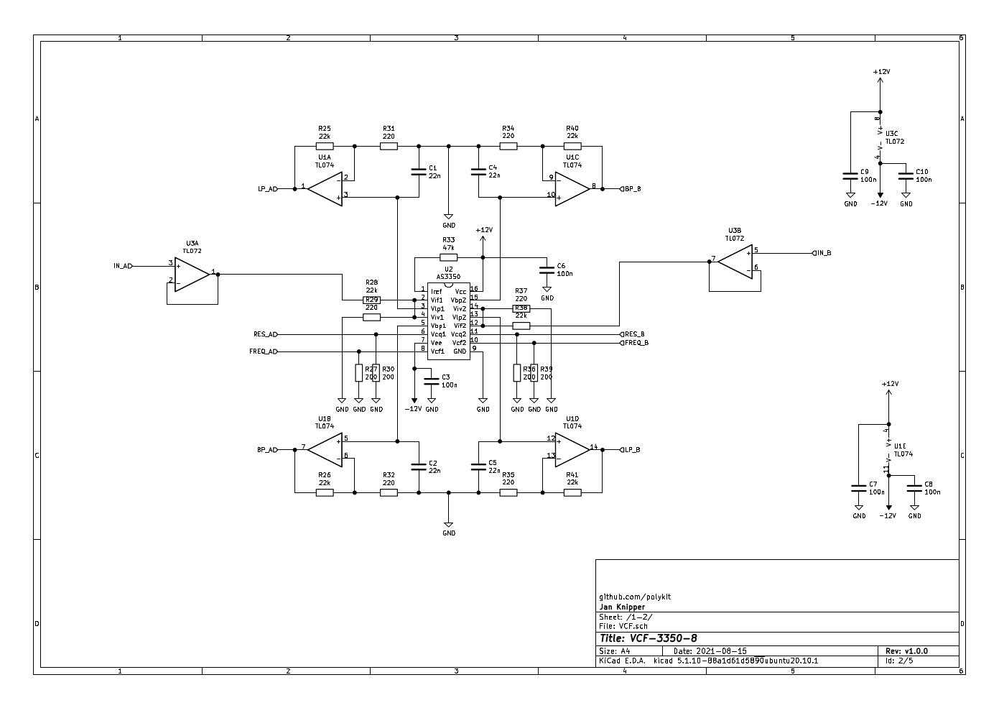

# Polykit VCF-3350-8

This repository contains schematics and Kicad PCB layout for an eight channel voltage controlled filter (VCF) based on the CEM3350/AS3350 state variable filter. Both frequency cutoff and resonance (Q) are voltage controllable. It offers a simoultaneous low-pass and band-pass output.

## References

https://electricdruid.net/datasheets/AS3350.pdf

http://www.synfo.nl/datasheets/CEM3350.pdf

http://www.electricdruid.net/datasheets/EMEngCEM3350.pdf

https://archive.org/details/sm_Synthesource_Issue_2

http://www.digisound80.co.uk/digisound/modules/80-16.htm

https://kg.kg/cem3350-eurorack-filter/
